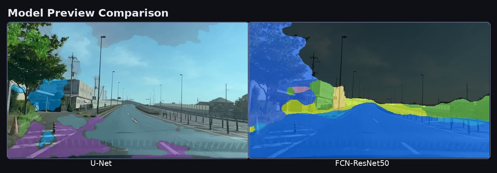
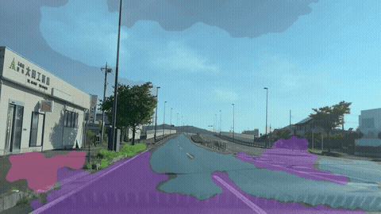
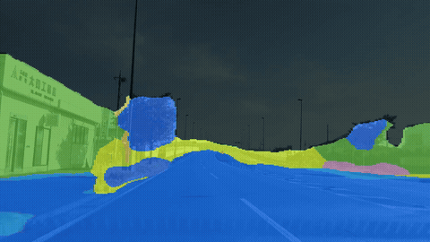
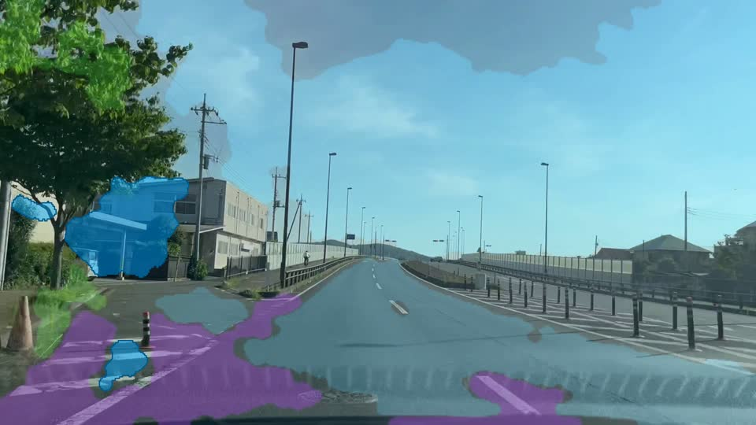
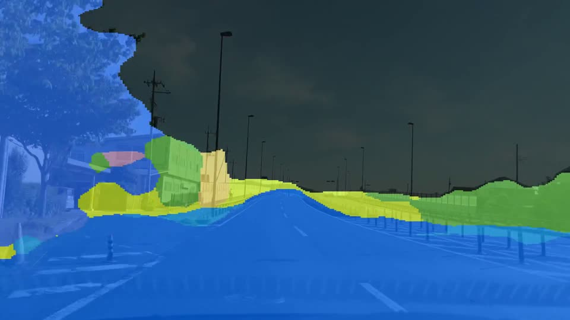

# Semantic Segmentation for Self-Driving Cars with U-Net and FCN

[](https://huggingface.co/spaces/piopanjaitan/Segmentation_Unet_and_F8CN)
[](https://www.python.org/)
[](https://pytorch.org/)
[](https://www.gradio.app/)

Semantic segmentation project for urban road-scene understanding using **U-Net** and a comparison model based on **FCN-ResNet50**.  
This project covers training, evaluation, Optuna tuning, video inference, Gradio testing, and Hugging Face deployment.

## Demo

- Hugging Face Space: [Segmentation_Unet_and_F8CN](https://huggingface.co/spaces/piopanjaitan/Segmentation_Unet_and_F8CN)
- Presentation PDF: [U-Net vs FCN-ResNet50 Presentation](presentation_unet_vs_fcn_resnet50.pdf)

## Main Files

- Main notebook: [`self_driving_car_unet.ipynb`](self_driving_car_unet.ipynb)
- FCN training notebook: [`fcn_resnet50_training.ipynb`](fcn_resnet50_training.ipynb)
- FCN Optuna notebook: [`fcn_resnet50_optuna.ipynb`](fcn_resnet50_optuna.ipynb)
- Model checkpoint: [`best_unet_model.pth`](best_unet_model.pth)

## Classes

The dataset contains 12 classes:

`Sky`, `Building`, `Pole`, `Road`, `Pavement`, `Tree`, `SignSymbol`, `Fence`, `Car`, `Pedestrian`, `Bicyclist`, `Unlabelled`

## Results

### U-Net

- Best validation loss: `1.0252`
- Best validation mIoU: `0.5251`
- Test loss: `0.9841`
- Pixel Accuracy: `0.8614`
- Macro F1: `0.6658`
- Mean IoU: `0.5550`

### FCN-ResNet50

- Best validation loss: `0.2805`
- Best validation Dice: `0.6680`
- Best validation IoU: `0.8646`
- Pixel Accuracy: `0.9137`
- Macro Precision: `0.7214`
- Macro Recall: `0.7251`
- Macro F1: `0.7157`

### Optuna

**U-Net**
- Best optimizer: `Adam`
- Learning rate: `0.0010370844668954541`
- Weight decay: `0.0048696409415209`

**FCN-ResNet50**
- Best optimizer: `Adam`
- Learning rate: `8.17949947521167e-05`
- Weight decay: `2.9204338471814107e-05`

## Visual Results

### Model Preview Comparison



### U-Net Video Preview



### FCN-ResNet50 Video Preview



### Preview Thumbnails

| U-Net | FCN-ResNet50 |
|---|---|
|  |  |

### Quick Comparison

| Model | Pixel Accuracy | Macro F1 | Main Video File |
|---|---:|---:|---|
| U-Net | `0.8614` | `0.6658` | [`assets/video_unet_web.mp4`](assets/video_unet_web.mp4) |
| FCN-ResNet50 | `0.9137` | `0.7157` | [`video_fcn_resnet50_output.mp4`](video_fcn_resnet50_output.mp4) |

## Videos

- U-Net render output: [`video_unet_output.mp4`](video_unet_output.mp4)
- U-Net browser-friendly output: [`assets/video_unet_web.mp4`](assets/video_unet_web.mp4)
- FCN-ResNet50 render output: [`video_fcn_resnet50_output.mp4`](video_fcn_resnet50_output.mp4)
- Gradio render output: [`video_gradio_output.mp4`](video_gradio_output.mp4)
- U-Net preview GIF: [`assets/preview_unet.gif`](assets/preview_unet.gif)
- FCN preview GIF: [`assets/preview_fcn.gif`](assets/preview_fcn.gif)
- U-Net preview GIF small: [`assets/preview_unet_small.gif`](assets/preview_unet_small.gif)
- FCN preview GIF small: [`assets/preview_fcn_small.gif`](assets/preview_fcn_small.gif)
- U-Net thumbnail: [`assets/thumbnail_unet.jpg`](assets/thumbnail_unet.jpg)
- FCN thumbnail: [`assets/thumbnail_fcn.jpg`](assets/thumbnail_fcn.jpg)
- Model comparison banner: [`assets/comparison_banner.jpg`](assets/comparison_banner.jpg)

## Installation

```bash
git clone https://github.com/piopanjaitan/Semantic_Segmentation_for_Self-Driving_Cars_with_UNet_and_F8CN.git
cd Semantic_Segmentation_for_Self-Driving_Cars_with_UNet_and_F8CN
pip install -r requirements.txt
```

## How to Run

1. Open the main notebook:
   - [`self_driving_car_unet.ipynb`](self_driving_car_unet.ipynb)
2. Run dataset validation, EDA, model, training, evaluation, and video cells in order.
3. Use the Gradio section in the notebook or the Hugging Face Space for demo testing.

## Repository Structure

```text
.
├── README.md
├── requirements.txt
├── LICENSE
├── best_unet_model.pth
├── fcn_resnet50_optuna.ipynb
├── fcn_resnet50_training.ipynb
├── presentation_unet_vs_fcn_resnet50.pdf
├── self_driving_car_unet.ipynb
├── video_fcn_resnet50_output.mp4
├── video_gradio_output.mp4
├── video_unet_output.mp4
└── assets/
    ├── comparison_banner.jpg
    ├── preview_fcn.gif
    ├── preview_fcn_small.gif
    ├── preview_unet.gif
    ├── preview_unet_small.gif
    ├── thumbnail_fcn.jpg
    ├── thumbnail_unet.jpg
    └── video_unet_web.mp4
```

## Notes

- U-Net notebook includes video rendering, playback, and Gradio integration.
- FCN comparison in this repository uses `torchvision.models.segmentation.fcn_resnet50`.
- Browser playback can still depend on codec support in the runtime environment.

## 👤 Penulis
Ridwan Pioneer Panjaitan